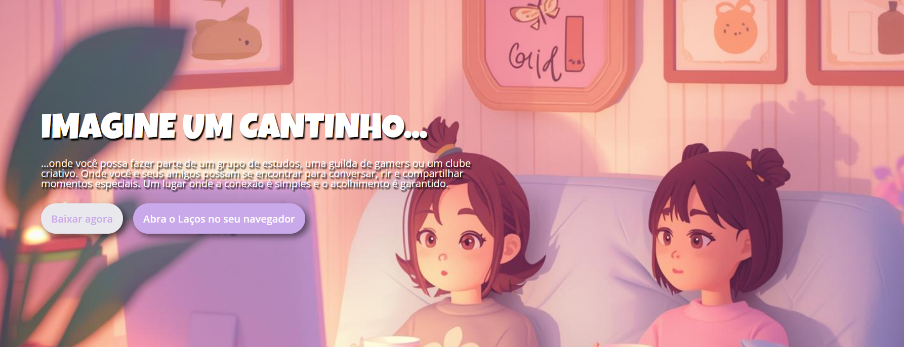
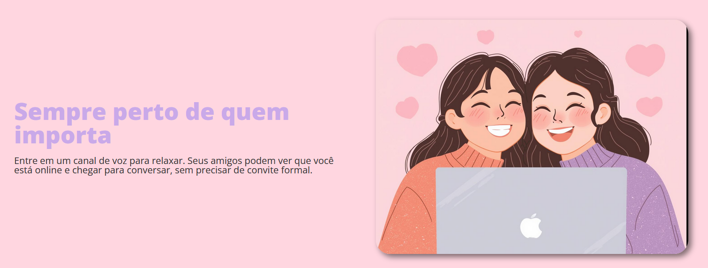
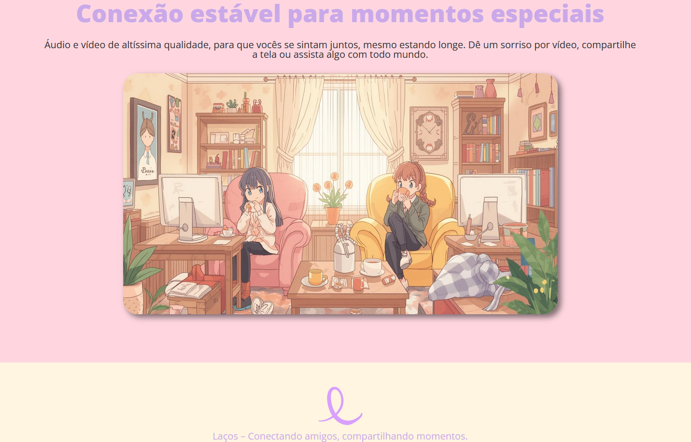

## 🎀 Laços

**Laços** é uma página web inspirada na plataforma do **Discord**, recriada e personalizada para demonstrar habilidades de Front-End, com foco em **HTML semântico, CSS moderno e responsividade**. Desenvolvido como parte do **bootcamp Santander 2025 - Front-End, em parceria com a DIO**.

 

## 🚀 Sobre o Projeto

Este projeto foi desenvolvido como parte do desafio prático do bootcamp:

* "Santander 2025 - Front-End"

A proposta era **clonar a página do Discord**, aplicando conceitos de **responsividade, Flexbox e CSS moderno**, e ao mesmo tempo personalizar a interface para criar uma identidade própria.

## 📚 Objetivos do Desafio

* Reproduzir a interface do **Discord aplicando HTML semântico e CSS avançado**;
* Criar uma página totalmente **responsiva**, adaptável a diferentes tamanhos de tela;
* Personalizar **cores, tipografia e elementos visuais**, dando identidade própria ao projeto;
* Desenvolver uma **interface organizada e acessível**, mantendo boas práticas de design;
* Construir um **projeto para portfólio** que demonstre criatividade e habilidades técnicas.

## 🛠️ Tecnologias Utilizadas

## 🖼️ Visualização do Projeto

Uma prévia das principais funcionalidades de **Laços**:

**🌐 Acesse o Projeto Online**

O projeto está disponível para visualização na **Vercel**. Clique no link abaixo para acessar:

**🌟 Tela Inicial**

Página inicial com destaque para a identidade visual de Laços e call-to-action para baixar ou acessar pelo navegador.

**📌 Conteúdo e Destaques**

Seções que apresentam informações sobre Laços e elementos visuais diferenciados, incentivando interação e imersão.

**🎨 Personalização Visual**

Cores, tipografia e logo própria aplicados à interface, dando ao projeto uma identidade única e criativa.

